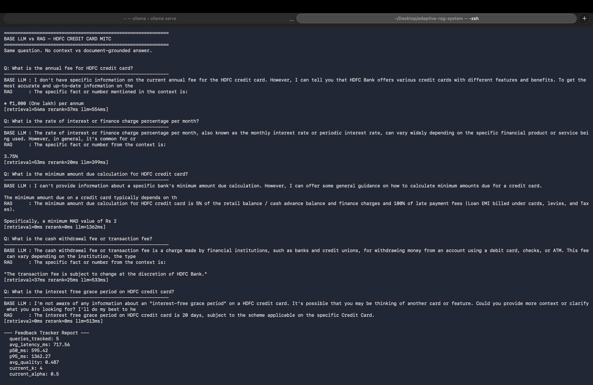
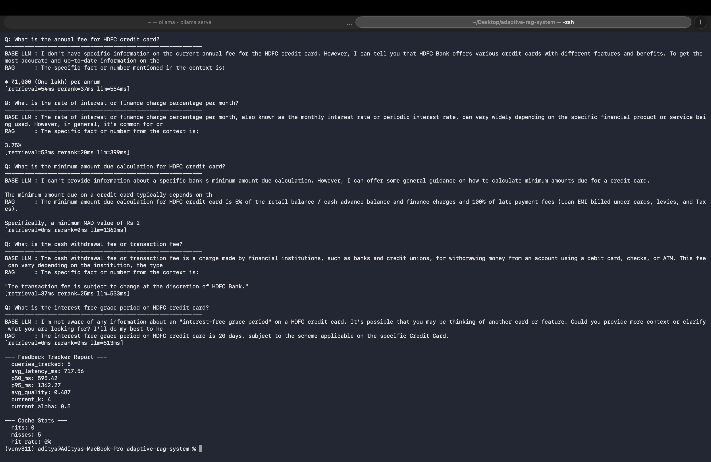
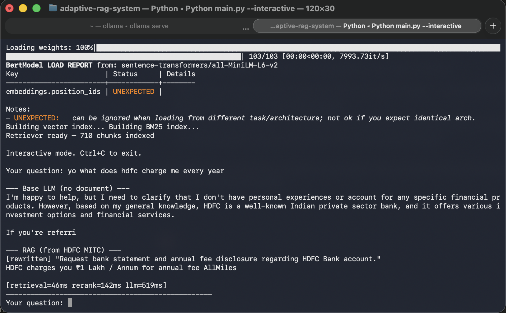

# Adaptive RAG Inference System

Local RAG pipeline that optimizes itself at runtime. No API keys. Runs entirely on your machine using Ollama.

Built as part of an AI inference internship assignment at Indicnode.

---

## What it does

Takes a question, figures out how complex it is, searches an actual document using both meaning-based and keyword search, reranks the results, and generates an answer. Tracks latency after every query and adjusts itself automatically.

In interactive mode — you can type however you want. The system rewrites your question into clean document language before searching.

---

## Demo — HDFC Credit Card MITC

Base LLM vs RAG on the same question. One guesses, one reads the document.




### Query Rewriting in action



---

## Benchmark Results

Run on HDFC MITC PDF — 10 queries, no LLM call (retrieval + rerank only).

| Metric | Fixed K=3 | Adaptive K | Diff |
|--------|-----------|------------|------|
| P50 latency ms | 44.36 | 42.66 | -1.7 |
| P95 latency ms | 92.72 | 100.25 | +7.53 |
| P99 latency ms | 95.85 | 111.88 | +16.03 |
| Avg retrieval ms | 18.5 | 6.09 | -12.41 |
| Avg rerank ms | 31.43 | 46.01 | +14.58 |
| Avg total ms | 49.93 | 52.1 | +2.17 |

**Cache:**
- Cold avg: 43.68ms → Warm avg: 0.0ms
- Speedup: **4367x faster** on repeated queries

Adaptive K wins on retrieval (fetches fewer chunks for simple queries) but the reranker offsets the gain at p99. Cache is the biggest win by far.

---

## Stack

| Component | Technology |
|-----------|------------|
| LLM | llama3.2:1b via Ollama |
| Embeddings | all-MiniLM-L6-v2 |
| Vector Index | FAISS HNSW (in-memory) |
| Keyword Search | BM25 |
| Reranker | ms-marco-MiniLM-L-6-v2 |
| Runtime | Python 3.11 |

---

## Project Structure

```
adaptive-rag-system/
├── main.py
├── src/
│   ├── ingestion.py      # PDF loading and chunking
│   ├── retriever.py      # hybrid FAISS + BM25 search
│   ├── adaptive.py       # query complexity, K selection
│   ├── reranker.py       # cross-encoder reranking
│   ├── feedback.py       # latency tracker, auto K adjustment
│   ├── cache.py          # semantic cache using cosine similarity
│   ├── decompose.py      # multi-part query splitting
│   └── benchmark.py      # p50/p95/p99 latency benchmarks
├── data/
│   └── hdfc_credit_card.pdf
├── screenshots/
├── requirements.txt
└── notes.txt
```

---

## Setup

```bash
git clone https://github.com/Aditya-git21/adaptive-rag-system
cd adaptive-rag-system
python3 -m venv venv311
source venv311/bin/activate
pip install -r requirements.txt
ollama pull llama3.2:1b
```

---

## Run

```bash
# open a separate terminal first
ollama serve

# then
source venv311/bin/activate

# demo mode — BASE LLM vs RAG comparison
python3 main.py demo

# interactive mode — type anything, rewriting handles the rest
python3 main.py --interactive

# run latency benchmark
python3 src/benchmark.py
```

---

## Demo Queries

Copy-paste these to test the system:

```
What is the annual fee for HDFC credit card?
What is the rate of interest or finance charge percentage per month?
What is the minimum amount due calculation for HDFC credit card?
What is the cash withdrawal fee or transaction fee?
What is the interest free grace period on HDFC credit card?
```

---

## What worked

- simple queries fetch 2 chunks, complex fetch 6 — retrieval 3x faster with adaptive K
- cache returns repeated queries at 0ms — 4367x speedup over cold retrieval
- feedback loop reduces K automatically when p95 latency spikes
- hybrid search finds things pure vector and pure keyword both miss independently
- query rewriting lets users type naturally — casual input normalized before retrieval
- semantic cache hits exact and near-exact matches at cosine similarity 1.0

## What didn't work

- adaptive K loses at p99 — reranker cost offsets retrieval gains on complex queries
- semantic cache misses paraphrases — "annual fee" vs "hdfc annual membership fee" scores 0.55, below safe threshold of 0.75
- query rewriting with a 1b model is inconsistent — sometimes rewrites make retrieval worse
- all-MiniLM-L6-v2 too small to bridge paraphrases — a larger embedding model would fix semantic cache misses

---

## Progress

| Day | What was built |
|-----|----------------|
| 1 | Basic pipeline — chunking, hybrid retrieval, adaptive K, feedback tracker |
| 2 | Cross-encoder reranker, switched to real PDF |
| 3 | Query cache, cache hit benchmark |
| 4 | Fixed K vs adaptive K benchmark |
| 5 | Query decomposition |
| 6 | Base LLM vs RAG comparison mode |
| 7 | Switched to HDFC MITC PDF, tuned queries to match document terminology |
| 8 | Query rewriting in interactive mode |
| 9 | Semantic cache — embedding based similarity, measured paraphrase scores |
| 10 | Full latency benchmark — p50/p95/p99, fixed K vs adaptive K vs cache |
