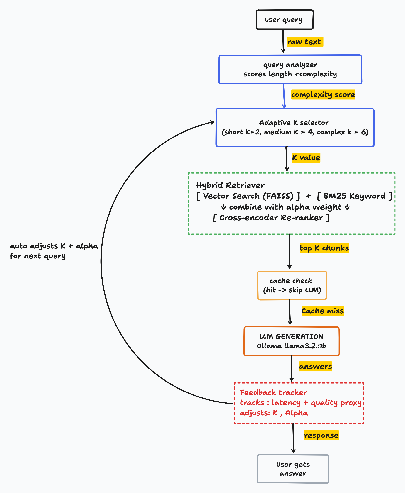

# Adaptive RAG Inference System

Local RAG pipeline that optimizes itself at runtime.
No API keys. Runs on your machine using Ollama.



---

## Stack
Python 3.11, FAISS, BM25, Ollama (llama3.2:1b), sentence-transformers

---

## What it does
Takes a question, figures out how complex it is, searches a 
document using both meaning-based and keyword search, reranks 
the results, and generates an answer. Tracks latency after 
every query and adjusts search depth automatically.

---

## Progress

### Day 1
Built basic pipeline — chunking, hybrid retrieval, adaptive K, feedback tracker.

| P50 | P95 | Quality |
|-----|-----|---------|
| 957ms | 2126ms | 0.532 |

Problem: only 3 chunks, retrieval order was approximate.
Fix: add reranker, use real PDF.

### Day 2
Added cross-encoder reranker. Switched to real RAG paper PDF (62 chunks).

| P50 | P95 | Quality |
|-----|-----|---------|
| 1579ms | 2705ms | 0.631 |

Quality improved. LLM is 85% of total time — retrieval is not the bottleneck.
Fix: add cache, build before/after benchmark.

---

### Day 3
Added cache layer. Repeated queries return instantly from memory.

| Metric | Value |
|--------|-------|
| Cache hit time | 0ms |
| Without cache | 2025ms |
| Hit rate | 40% with 5 queries |

Problem: cache only matches exact same string. "What is inheritance" 
and "What is inheritance in OOP" are different keys — both miss cache.
Fix next: semantic cache using embeddings as keys.

---

### Day 4
Built benchmark report — fixed K=3 vs adaptive K across 10 queries.

| Metric | Fixed K=3 | Adaptive K | Diff |
|--------|-----------|------------|------|
| P50 latency | 56ms | 45ms | -10ms |
| P95 latency | 78ms | 70ms | -7ms |
| Avg retrieval | 17ms | 5.85ms | -11ms |
| Avg rerank | 38ms | 40ms | +2ms |
| Avg total | 55ms | 46ms | -9ms |

Adaptive K wins on every metric except rerank (+2ms).
Retrieval is 3x faster because simple queries get K=2 instead of K=3.
Rerank is slightly slower because complex queries get K=6 — more chunks to score.

Problem: LLM not included in benchmark — too slow to run 20x.
Next: query decomposition bonus feature.

## How to run
```bash
source venv311/bin/activate
ollama serve  # separate terminal
python3 main.py
```

### Day 5
Added query decomposition. Multi-part queries split into sub-queries, each searched separately, answers merged.

Example:
- Input: "What is inheritance and what is polymorphism?"
- Split: ["what is inheritance", "what is polymorphism?"]
- Result: polymorphism got CACHE HIT 0ms — already cached from earlier query

Problem: pronouns break decomposition. "how is it different from a method" loses "it" context.
Fix would be passing first sub-query result as context into second sub-query.

Benchmark after Day 5:
P50: 29ms (was 46ms Day 4) — 36% faster
P95: 71ms (same)
Quality: 0.701 (improving each day)

## what worked 

- simple query fetches 2 chuks , medium query 4 chunks and complex 6 chunks , that actually made data retrival 3x faster

- cache saved time on repeated query/question almost ~0ms 

- feedback loop reduced k on its own when system got slow 

- hybrid search found things that pure keywords and pure vector alone missed 

## what didn't work

- 1b model kept making things up, in helm pdf 4/5 queries were wrong even whn retriveal found right 

- cache is not useful or dumb sometimes , same query with different words misses every time.

- decomposition is also broken when query had "it" or "they" no context carried over 

## how it adapts 

Every query — system checks complexity, picks K, searches, reranks, generates, records time and quality. If slow — reduces K next time. If bad quality — increases K. No manual tuning, just runs and adjusts itself.

